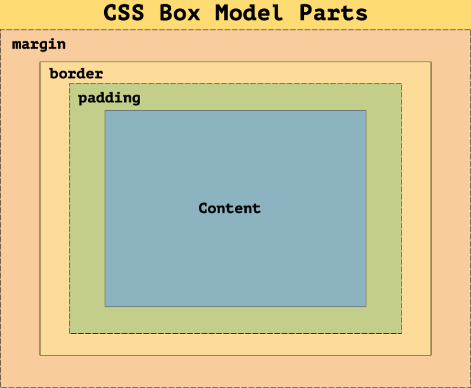

The **CSS box model** is a set of rules which determine the dimensions of every element in a web page. Every element in HTML is enclosed within a box and each box has some height, width, a border, some margin and padding. The rectangular box which encapsulates an element is not visible on the webpage unless you apply the CSS border property upon that element.



Let’s discuss all these box model properties:

**Height**: Every Element has a default height which is always decided by the content inside the box.Height can be changed for block level and inline-block level elements but not for the inline level elements.

**Width**: Every element has a default width which is decided by the display property of the element. If it is a block level element, it will have a default width of 100%, covering the entire page or the entire width of it’s parent container.

Width of an inline level element is decided by it’s content. Much like height, width can also be changed for block level and inline-block level elements but not for inline level elements.

**Padding**:Padding is the space between a content and the border around that content. Sometimes it’s also referred to as breathing space for the content. For the block and inline-block elements, padding works normally. But when it comes to applying padding for inline-level elements, it works a bit differently. The vertical padding( top and bottom) may blend into the line of above and below elements but will be displayed. The left and right padding will work normally.

**Border**: The border is to provide some outline around an element. Border area is the area between the box’s padding and margin. Its dimensions are given by the width and height of border.To apply border we have border property which requires three different values: `border-width, border-style, and border-color`.

There is another border property known as _border-radius_. This property is used to provide rounded or soft corners around an element.

**Margins**: Margin consists of space between border and margin. The dimensions of Margin area are the margin-box width and the margin-box height. It is useful to separate the element from its neighbors.

Margins can be defined for the block level and inline-block elements but for block level elements margins works differently. An inline level element accepts horizontal margins but vertical margins are ignored by the inline elements.

Since a box consists of all the above properties we just discussed, We shall take a look at how the total height and width of a box is calculated.

#### Total width:

```
margin-left + border-left + padding-left + width + padding-right + border-right + margin-right
```

#### Total Height:

```
margin-top + border-top + padding-top + width + padding-bottom + border-bottom + margin-bottom
```
