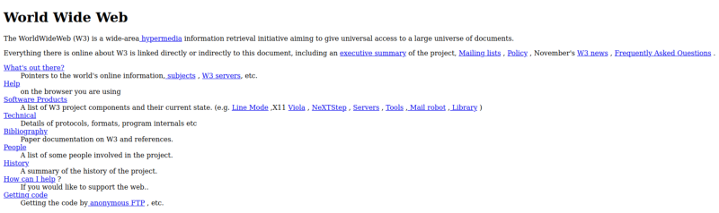
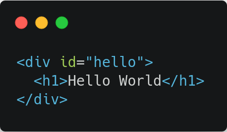
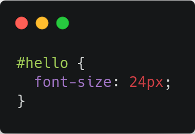
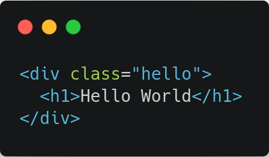
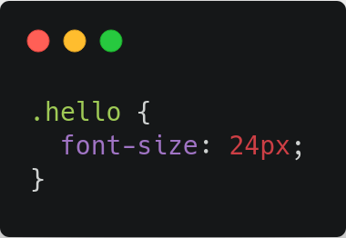
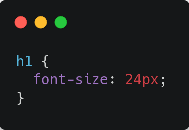
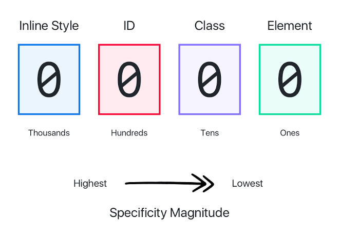
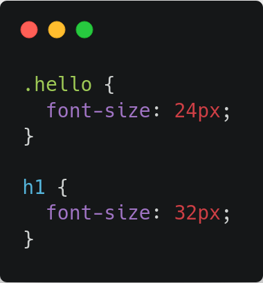

This is how the first web page looked like. Although it does the job but it looks bland and not very interactive compared to the websites we work with today, doesn’t it?

To make their website more interactive and give it a lively feel Programmers started using stylesheet languages like RRP and PSL96. But the idea that grabbed everyone’s attention was first proposed by Håkon Wium Lie in October of 1994. It was called Cascading Style Sheets, or just CSS.

CSS was special because it was simple compared to its earliest competitors. When we write CSS, we don’t tell the browser exactly how to render a page. Instead, we _describe_ the rules for our HTML document one by one and let browsers handle the rendering.

Without CSS every browser has it’s own unique way to interpret the HTML content. Because every browser has been developed by different developers hence each browser has it’s own set of rules to render a webpage written in HTML. This might be an issue if you want your website to be browser independent and responsive. To overcome this developers use CSS resets. A CSS reset basically resets the style of the web page to a default value irrespective of the browser. One of the most popular CSS resets is [Eric Meyer’s reset](https://meyerweb.com/eric/tools/css/reset/). CSS resets work since CSS is unique in a singular way. It allows for styles to cascade. It’s right there in the name. _Cascading_ Style Sheets.

### Cascade

Cascade means that styles can inherit and overwrite other styles that had previously been declared. Hence CSS resets change all the default browser styles and give a reset style to the web page which can be overwritten later depending upon the requirement of user or the developer. It follows a fairly complicated hierarchy known as specificity. We will come back to specificity later since it requires a discussion about how various elements on a web page are styled using CSS or should we say how rules are described for various HTML elements.

There are three most common ways by which you can select a specific element to style it.

1.  Elements with id are selected using a `# operator before the class name`. It is used to select all the elements belonging to that particular id.HTML elements can also be styled using ID selectors .

**2.** **Using class selectors**, a class can be applied to one or more than one elements and then styles can be implemented upon the entire class. Elements belonging to a class are selected using a `. operator before the class name`.This will apply styles to all the elements belonging to that class.

Multiple classes can also be applied to a single element. Think of this like different rooms in a house, our job is to paint the rooms and add furniture to each room. Rooms here are analogous to HTML elements that need to be styled. Furniture and windows are the classes applied to each room. Since each room will have similar furniture hence the furniture class can be used to style all the rooms simultaneously whereas only rooms with windows have to be painted so the second class can be used to style rooms with windows separately.

3\. **Using a type selector**, where you apply styles to all the elements of that type. Providing a unique id to elements and then applying styles to that particular ID.

Complex selectors such as `nth-child` or `sibling selectors(~)` are also used to select HTML elements. To keep this article brief and precise we will reserve complex selectors for another article.

### Specificity

Coming back to specificity, every selector has its place in the specificity hierarchy. If two selectors apply to the same element, the one with higher specificity wins. The type selector has the lowest specificity weight and holds a point value of 0–0–1. The class selector has a medium specificity weight and holds a point value of 0–1–0. Lastly, the ID selector has a high specificity weight and holds a point value of 1–0–0. Specificity points are calculated using three columns. The first column counts ID selectors, the second column counts class selectors, and the third column counts type selectors.It should be noted that specificity always takes precedence over cascading property of CSS. Only when selectors have an equal specificity value, the latest rule is the one that counts. Let’s take a look at the images below to understand this better.

In the above code, if we consider the cascading nature of CSS then font-size should be cascaded to 32px but because of higher specificity of class selector over type selector, font-size is not cascaded and it is displayed as 24px. Specificity property of CSS takes precedence over cascading property.

Shay Howe has a very good [resource](https://learn.shayhowe.com/html-css/getting-to-know-css/) to learn CSS and get familiar with it’s properties as a beginner. CSS is easily one of the most interest languages to learn and master if front end web development excites you. I hope this information helps you in your journey as a developer.
