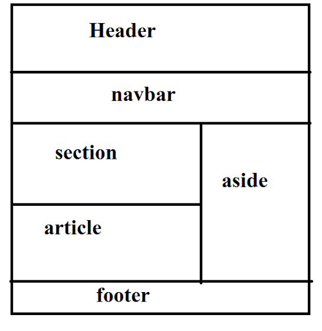
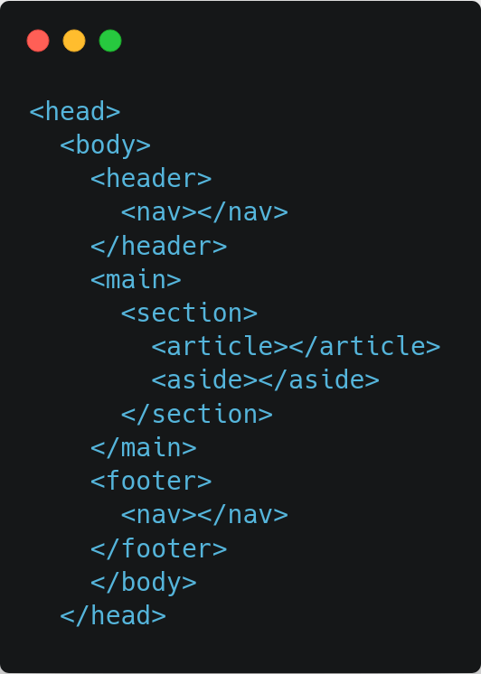

We’ve been dividing our Web pages into visible sections for well over a decade. The problem is, we’ve never had the right tools to do so. But with HTML5 we have the right tools to structure out HTML document with semantic elements. _Semantics is the practice of giving our code meaning_. It not only gives our code meaning but it also makes it more accessible. Google uses semantics to search content on the web and display the results to you.

### **Semantic tags**

Before HTML5 developers used to structure their code with the help of `
` elements. Although`
` prevents a section of the document from falling into another it doesn’t provide any meaning to the document. That’s why semantic tags are useful since they help distinguish each section of the document while doing everything that `
` is used for.

Some of most used semantic tags in HTML5 are `<main>`, `<header>`, `<section>`, `<article>`,`<nav>`, `<footer>`, and `<aside>`. We shall understand their use and how they help us structure our page one by one.

### <main>

A `<main>` tag usually come right after the starting `<body>` tag and it nests all the main contents of the document. It contains various sections in an HTML document except the header and footer of the web page. Page header and footer are kept out of the main section of the document.

### **<header>**

A `<header>` tag is used to define a header of a page or a section. It usually contains website branding, search or navigational links. It can either be used for the header of a page or as the header for an article or any other piece of on-page content. Elements within a page header are usually duplicated across all or most of the pages of the website.

### <section>

The `<section>` tag is an element designed to practically designate sections of document content. It represents the section of a document. Use of the `<section>` element is not to be thought of as outlining content that needs to be styled visually in a particular way. It is used to provide semantic structure to the page. It is a good practice to nest different sections of the web page within the `<section>` tag.

Since <section> represents different sections of an HTML document.

### <article>

The `<article>` element is used for indicating an article within an HTML document. It represents a section of content that forms an independent document, such as a blog post, article, or other self contained piece of information. It is used for syndication purposes.

Although a particular section of a web page should be contained within a `<section>` tag. An `<article>` tag can nest various `<section>` tags as well. Since an article will usually contain a few sections of it’s own.

### <nav>

`<nav>` tags are used for declaring a navigational section of the website. It contains elements that provide navigational links either within the document it is used in or to other documents. Common examples of navigational sections are menus and indexes.

### <aside>

This is also one of the new semantic tags in HTML. An `<aside>` tag is used to specify a section of a page aside from the related section. This tag can be used for sidebars, glossary definitions, call out boxes etc. All of these are contents which are only indirectly related to the main content of the document.

### <footer>

It’s a structural tag which defines a footer section of a page, document or an article. A `<footer>` typically contains copyright and authorship information or navigational elements pertaining to the contents of the parent element.

Just like a header element footer is also related to it’s parent element. If it inside an `<article>` element, then it is the footer of that article. If it is the last element inside the `<body>`element, then it is the footer of the whole webpage in which case it is usually duplicated across all the pages of a website.

When we use a semantic tag like an article tag, the text that is enclosed inside the `<article>` is immediately recognized by the browser as some type of article. You should be careful when using semantic tags to convey meaning rather than for presentation purposes, be careful that you don’t use them incorrectly simply for their common display properties.
