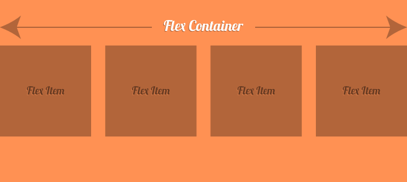

CSS provides various ways to position elements on an HTML webpage. Earlier developer used methods like float to position elements. Float was actually meant to position elements and then allowing text and inline elements to wrap around it. But there are a few shortcomings of using float to position elements on the webpage.

Float sends the floated elements out of the flow of the HTML document and the space occupied by floated element is vacated which an upcoming element tries to take up. To overcome this we use an additional class with pseudo elements usually referred to as the clearfix class or cf class.

One of the problems I face with float is that I need to calculate the respective margins as well as paddings to provide space between floated elements which is not that big of a task but I am really lazy when it comes to writing code and my aim is to design a webpage with minimum lines of code. This not only saves me time but also makes it easier to understand.

Flexbox is another method used for positioning elements in an HTML document minus the drawbacks of float. In a Flexbox layout, there is a flex container and then there are flex items. Elements which are positioned are known as flex items whereas the parent element to which the elements belong is known as the flex container.

Let’s take a brief look at how flex is applied to elements and it’s various properties. There are two sets of properties to keep in mind when using flexbox.



### 1\. Properties of parent element or the flex container:

### Display

This defines a flex container; inline or block depending on the given value. It enables a flex context for all its direct children.To make a flex container we need to declare display: flex or Flex-inline.

### Flex Direction

There are two axes in a flexbox layout namely main axis and cross axis. Main axis is the horizontal axis from left to right direction and cross axis is the vertical axis from top to bottom.

Items are always laid down on the main axis by default.

Flex direction property is used to change the direction in which items will be laid down. Even when you change the flex-direction, the elements are still aligned on the main axis. Only the directions of main axis and cross axis are interchanged.

The flex-direction property can accept four values:

```
flex-direction: row || column || row-reverse || column-reverse;
```

### Flex-wrap

By default, flex items will all try to fit onto one line. You can change that and allow the items to wrap as needed with this property.

The flex-wrap property can accept three values:

`Flex-wrap: no-wrap || wrap || wrap-reverse;`

### Flex-flow

Flex-flow is the shorthand for applying flex-direction and flex-wrap properties. These two properties together define the main axis as well as the cross axis of a flex container.

### Justify Content

Justify Content property works on the main axis. It defines how elements will be laid down on the main axis. It controls the alignment of the items on main axis by making use of the free space available in a flex container

The `justify-content` property can take 6 different values:

```
justify-content: flex-start || flex-end || center || space-between || space-around || space-evenly;
```

### Align Items

Align item property works on the cross axis. It defines how flex-items will be laid out on the cross axis.

The `align-items` property comes with four values:

```
align-items: stretch || flex-start|| flex-end|| center || baseline;
```

### Align Content

Like justify-content property, align-content property also controls the alignment of the items but on cross axis by making use of free space available in the container but in vertical direction.

Unlike last two properties that we discussed, align content property works on multi-line flex items.

If all the “flex-items” are on a single line in a container then this property does not affect. And as we all know from the above discussion that the `justify` woks on "main-axis" and `align` works on the "cross-axis", therefore the `align-content` property will also work on the "cross-axis".

```
align-content: stretch || flex-start || flex-end || center || space-between || space-around;
```

### 2\. Properties of flex items:

### Flex Grow

Flex-glow property allows the items to grow in width if there is extra space available inside the container.

By default, the value of flex-grow for each element is 0. It accepts any positive integer value and the value acts as a ratio to it’s default value. The increase in size of a flex-item when flex-grow is applied to it is proportionate to it’s default size.

### Flex Shrink

Flex-Shrink property is the opposite of flex-grow property. It allows the items to shrink in size to make space inside the container.

By default, the value of flex-grow for each element is 0. It accepts any positive integer value and the value acts as a ratio to it’s default value very much like the flex-grow property. The shrink in size of a flex-item when flex-shrink is applied to it is proportionate to it’s default size.

### Align Self

The align-self property is similar to align-item property of the parent element.

Like align item property also works on the cross axis. It accepts all the same values which align-item accepts. Difference between align-self property and align-items property is that align-item is applies to the flex-container whereas the align-self property is applied to the flex-items.

```
align-self: auto || stretch || flex-start || flex-end || center || baseline;
```
